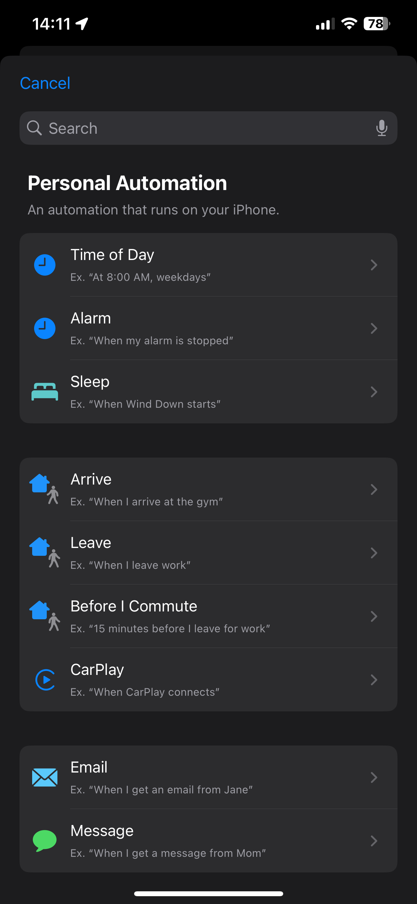
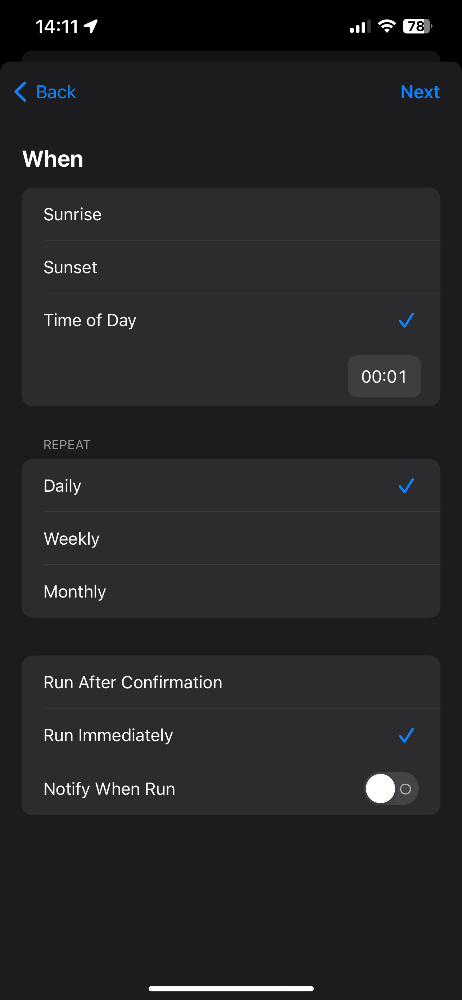
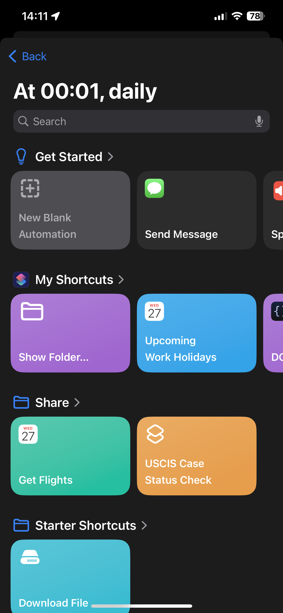
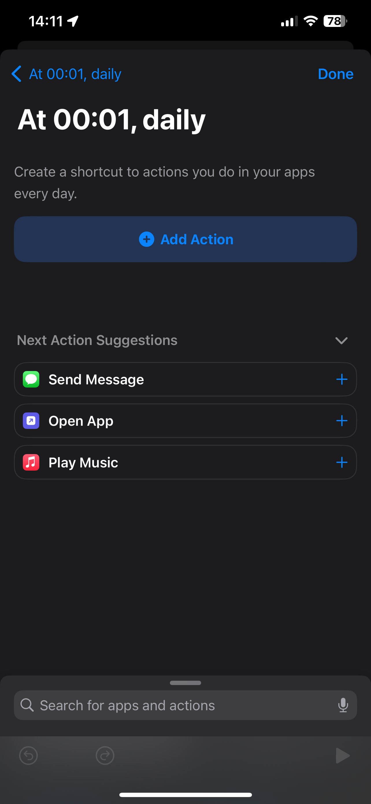
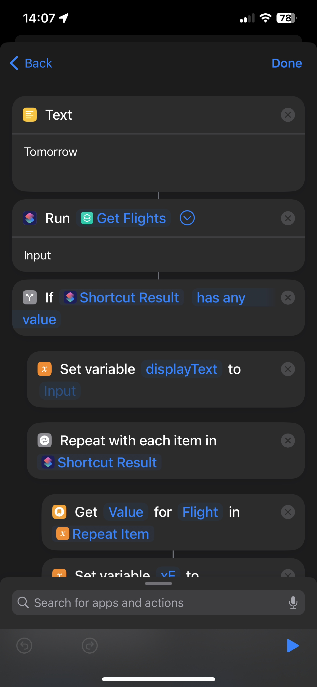
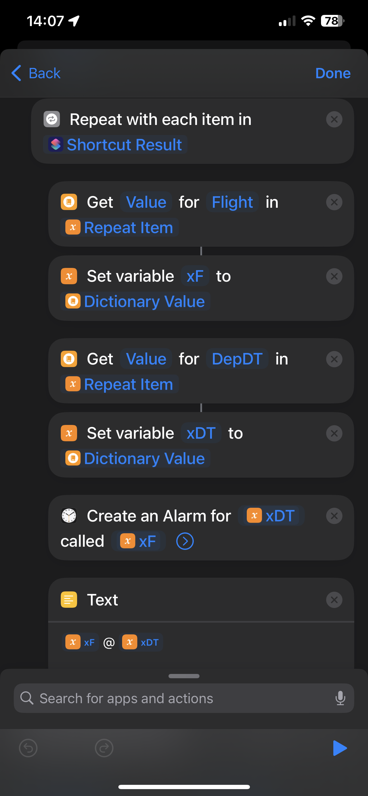
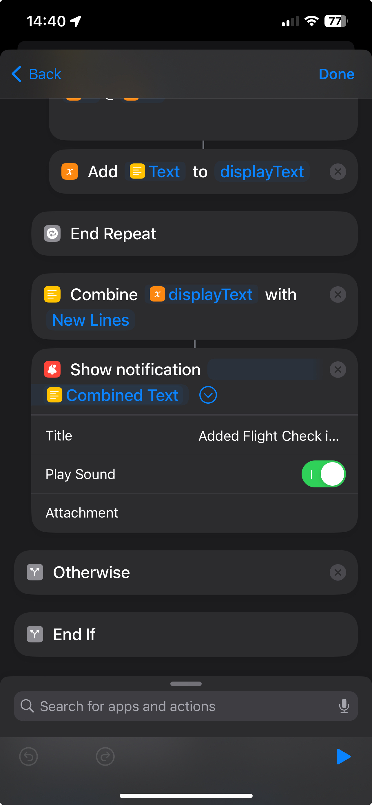

# Automation to **Create an Alarm for Flight Check-in**

## Description:
The Flight Check-in Reminder Shortcut is a handy automation designed to assist users in staying on top of their upcoming flights. Leveraging the power of Shortcuts on iOS, iPadOS, and macOS, this tool scans your calendar for flights scheduled for the next day and creates timely reminders for check-in.

**Features**:
1. Automatic Daily Trigger: The Shortcut is set to run daily, activating after midnight to ensure you receive timely reminders.
2. Calendar Event Retrieval: It fetches upcoming calendar events for the next day, specifically identifying flights based on specified criteria.
3. Check-in Alarm Creation: For each identified flight, the Shortcut calculates the optimal check-in time (24 hours before departure) and creates a reminder or alarm for the current day.
4. You need to download or create a Shortcut that retrieves Flight Schedules for a given day from here: https://github.com/hdonapati/missing-link/blob/main/Apple-Shortcuts/Shortcuts/GetFlights.md

> [!NOTE]  
> **Calendar Integration**: Ensure that your flight information is added to the calendar app associated with your mail app. This typically happens automatically when you receive a flight booking email.

---

## Setting up Automation:

1. Open the Shortcuts app and navigate to the "Automation" tab, use the '+' button on top-right  corner to create a new automation.

2. Select `Time of day`, in which choose the time you want the automation to run. I have selected it as `00:01` so that the whole day is covered, and `Daily` for the repeat.
  For last section, select the options as per your convenience.
     
  
3. Then choose `New Blank Automation`, which takes you to the screen where you can create the Automation routine.
     

  > You need to search for the Scripting blocks and have appropriate values/configurations as shown in the images.

4. Add a `Text` block, in which specify the value `Tomorrow` - becuase we need to fetch Flight's for next day. Then Add `Run Shortcut` block and select the `Get Flights` shortcut (This shortcut retruns the flights added in your calendar for a given date). Then add all the other blocks as shown in the images.
     

5. Then add the `Show Notification` block, with Title `Added Flight Check in alarms for:`
    

> [!TIP]
> Customize the Shortcut to your preferences, including notification settings and any additional features you may need. Alternatively you can create areminder instead of an alarm, or do both. Alarm better suited for my purpose.

---

**Contribution**:
This Shortcut is open to contributions and improvements. Feel free to suggest enhancements, or report issues. Together, we can make travel preparations even more convenient and stress-free.

Happy travels!

