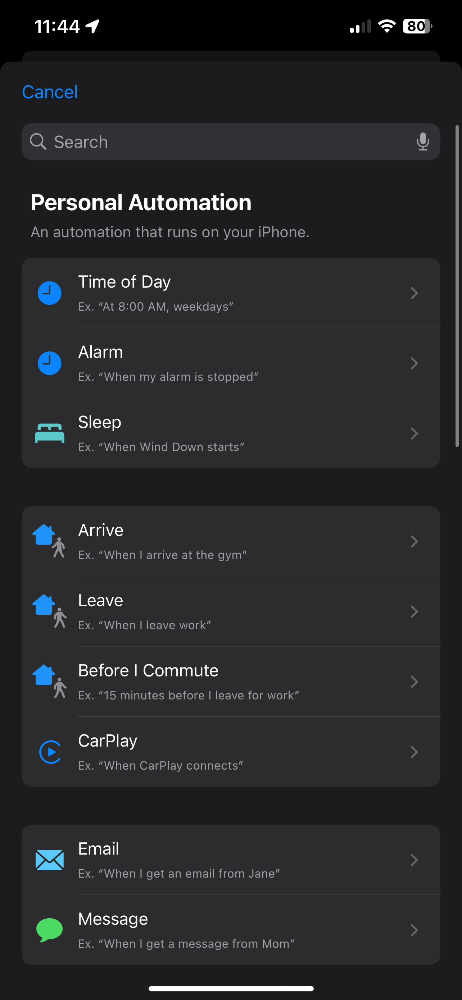
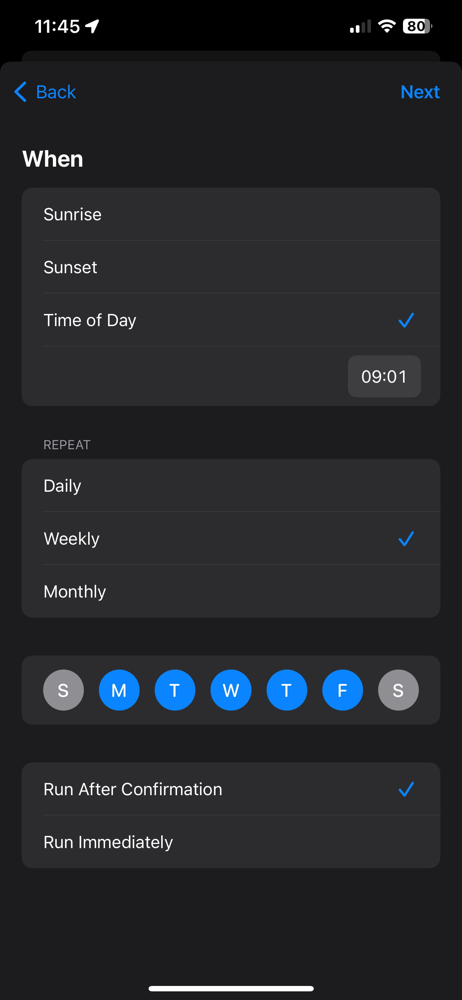
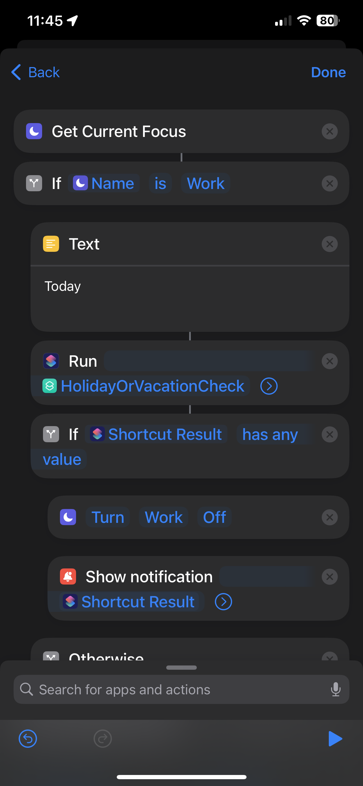
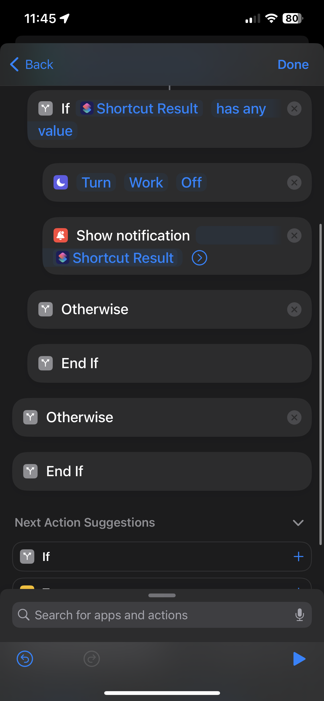

# Automation to `Work Focus Mode`

## Description:

This is a handy automation designed to assist users in Toggle Work Focus mode based on their current day work schedule, for which the events are added to the Calendar.

Features:
1. Automatic Daily Trigger: The Shortcut is set to run at `09:01` (configurable for your needs).

2. Calendar Event Retrieval: It fetches upcoming Work calendar events for the current day, identifying if it's a Vacation Day or Work Holiday. This is acheived by `Holiday or Vacation Check` Shortcut. You need to download or create similar shortcut that checks if it is a work related Holiday or Vacation for a given day from here: https://github.com/hdonapati/missing-link/blob/main/Apple-Shortcuts/Automations/Work-Alarms/Setup.md

3. Toggling Focus mode: The Automation retrives toggles off Work Focus mode when it is a work related Holiday or Vacation also giving a notifcation, or else leaves it on.

## Setting up Automation:

1. Open the Shortcuts app and navigate to the "Automation" tab, use the '+' button on top-right corner to create a new automation. Select Time of day, in which choose the time you want the automation to run. I have selected it as `09:01` so that it's just after a minute when the OS does turn on the automatiuon for me, and select all of your Work Days. For last section, select the options as per your convenience.
      
   
2. Then choose `New Blank Automation`, which takes you to the screen where you can create the Automation routine.

   > You need to search for the Scripting blocks and have appropriate values/configurations as shown in the images.

3. Add a `Text` block, in which specify the value `Tomorrow` - because we need to fetch Schedule for next day. Then Add `Run Shortcut` block and select the `Holiday or Vacation Check` shortcut. Then add all the other blocks as shown in the images.
     

4. In the `Show Notification` block, add the Title `Turning off Work focus`

> [!TIP]
> Customize the Shortcut to your preferences, including notification settings and any additional features you may need. 

---

**Contribution**:
This Shortcut is open to contributions and improvements. Feel free to suggest enhancements, or report issues. Together, we can make travel preparations even more convenient and stress-free.
