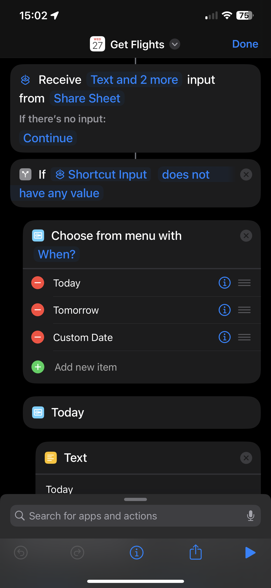
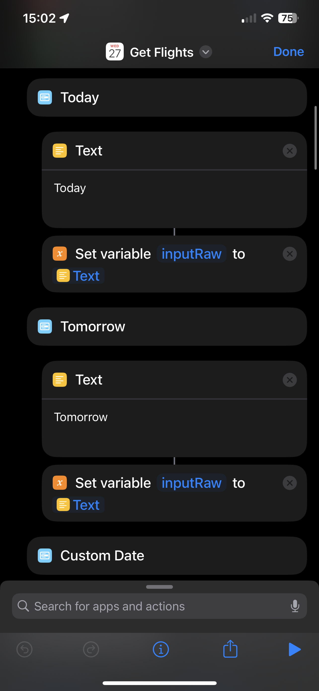
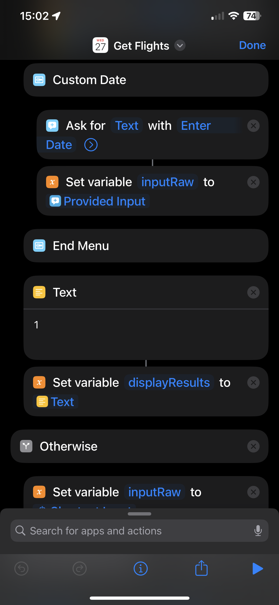
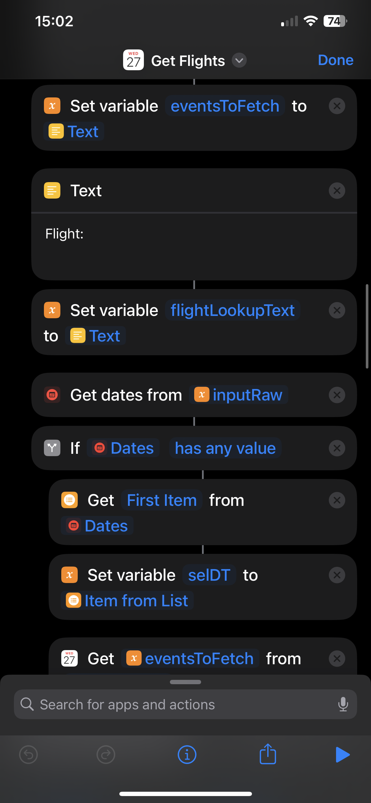
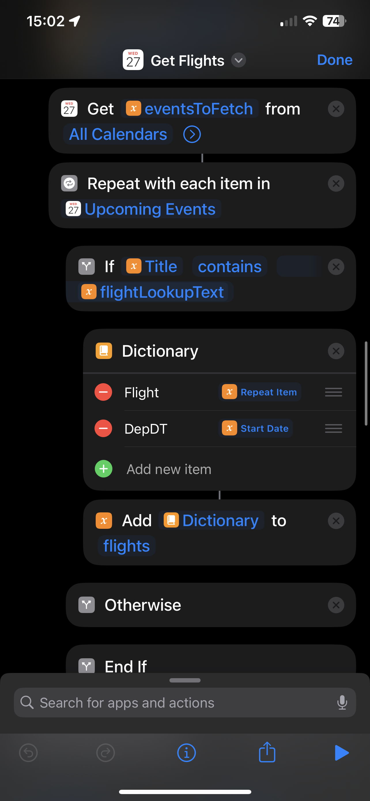
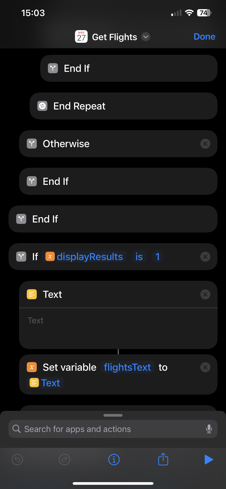
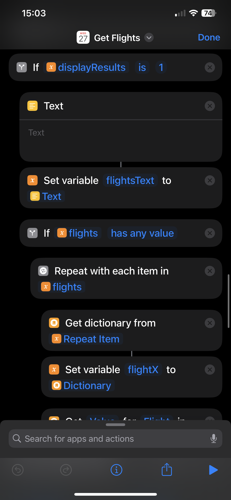
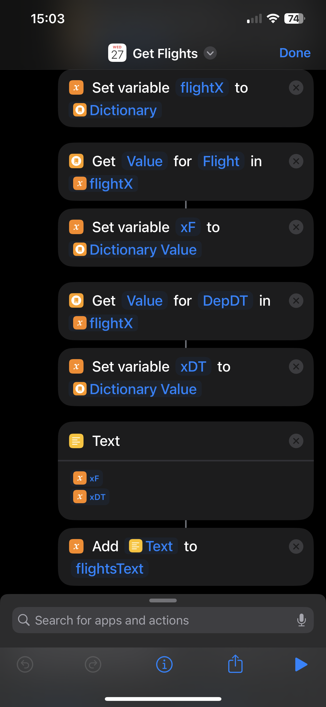
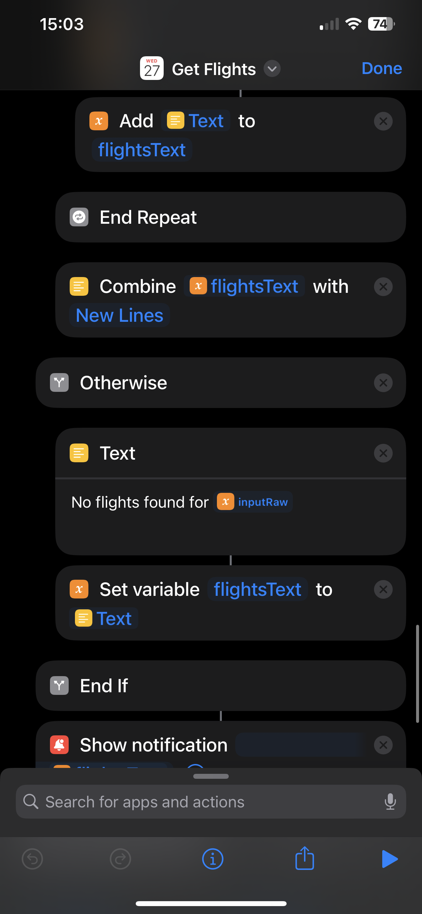

# `Get Flights` Shortcut

> [!WARNING]  
> Your device might say that the Shortcut is untrusted, so please check how to add untrusted shortcuts. Unfortunately Apple changes the way to do frequently, so better to Google how to do this. 

 Shortcuts iCloud Link: https://www.icloud.com/shortcuts/5d7e5572e3264586af7ade590a38c3af

## Demo: 
https://raw.githubusercontent.com/hdonapati/missing-link/main/Apple-Shortcuts/Shortcuts/GetFlights/images/Demo.MP4

## DIY Setup:

> You need to search for the Scripting blocks and have appropriate values/configurations as shown in the images.

 
   
   
   
   

