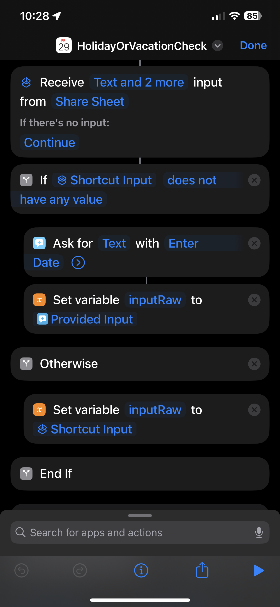
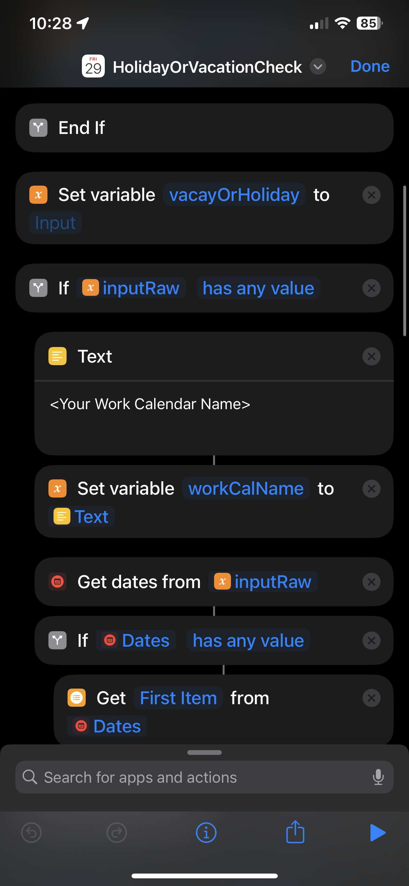
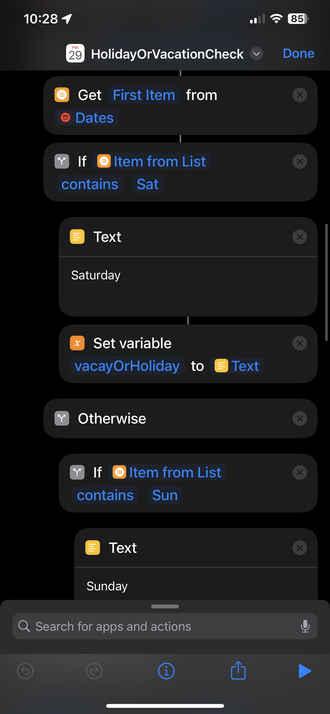
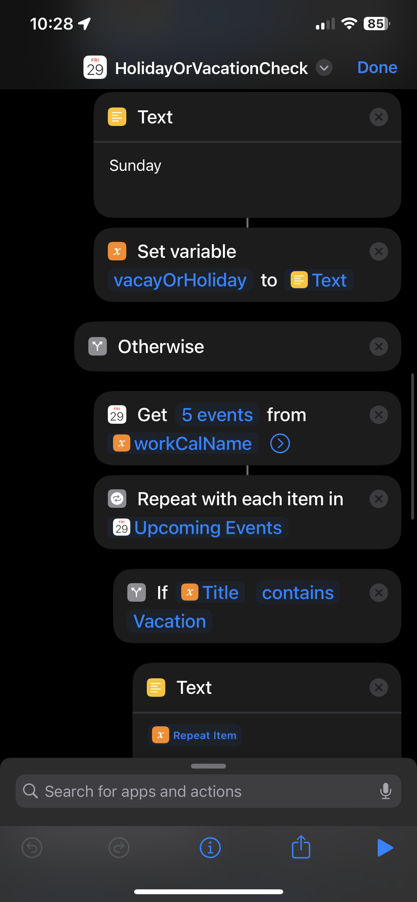
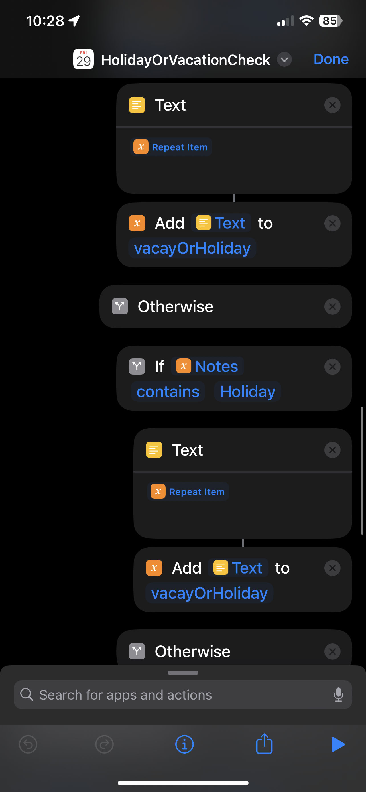
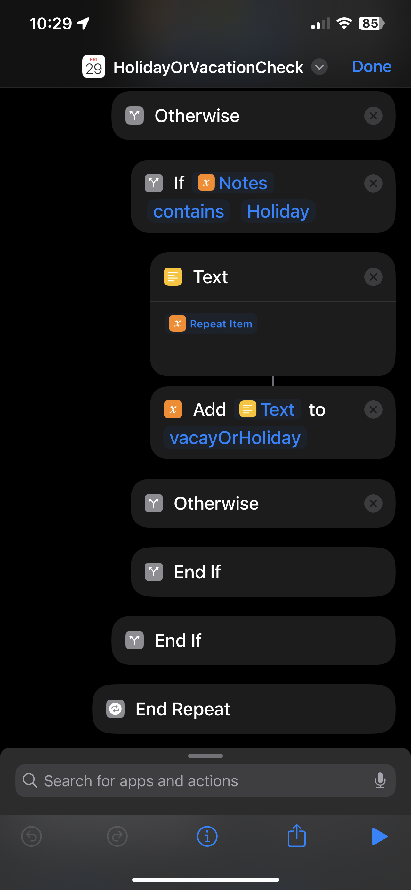
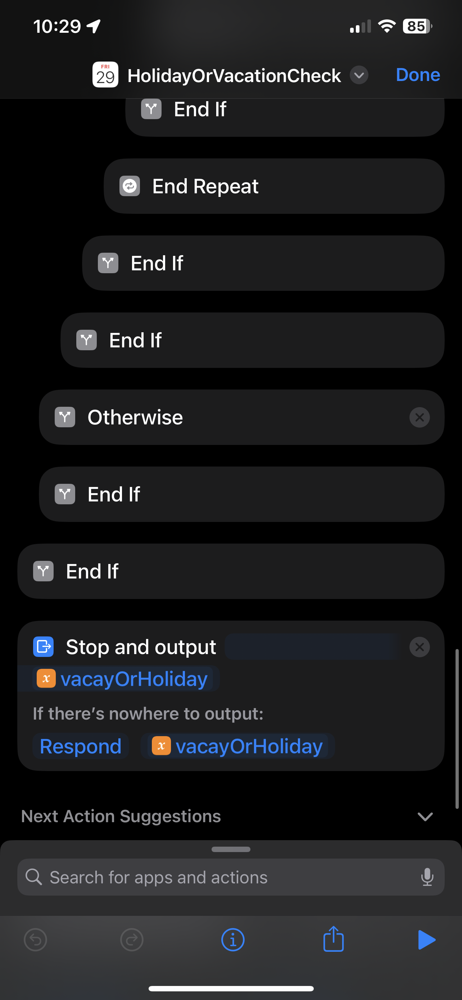

# `Holiday or Vacation Check` Shortcut

> [!WARNING]  
> Your device might say that the Shortcut is untrusted, so please check how to add untrusted shortcuts. Unfortunately Apple changes the way to do frequently, so better to Google how to do this. 

 Shortcuts iCloud Link: https://www.icloud.com/shortcuts/5d7e5572e3264586af7ade590a38c3af

## Overview:
In our fast-paced lives, keeping track of work commitments, vacation days, and holidays can become challenging. To address this, I've developed an Apple Shortcut that simplifies the process of checking whether a given date is a vacation day or a work holiday. This shortcut can be used in Automations to turn of the Work Releated Alarms for next day or turn off Work Focus mode for same day.

**Implementation**:
I've designed this Apple Shortcut to take a date as input and query your work calendar for corresponding events. The shortcut then identifies whether the date is associated with a vacation day or a work holiday. Here's how it works:

* **Input Date**: You provide the date you want to check.
* **Calendar Lookup**: The shortcut interacts with your work calendar, searching for events on the specified date.
* **Event Identification**: If an event is found, the shortcut identifies whether it is a vacation day or a work holiday.
* **Output**: The shortcut returns the name(s) of the calendar event, providing a clear indication of whether it's a day off or a work-related commitment.

## Structuring Work Events in Calendar App:
* Work Holidays are set up as an All day event in the Work Calendar, and the Notes says `Holiday`.
* Vacation days are set up as an All day event in the Work Calendar, and the Title itself says `Vacation`.
* You can add other conditions to better suit your purposes, based on how your Calendar events are structured.

## DIY Setup:

> You need to search for the Scripting blocks and have appropriate values/configurations as shown in the images.

 
   
   
  
